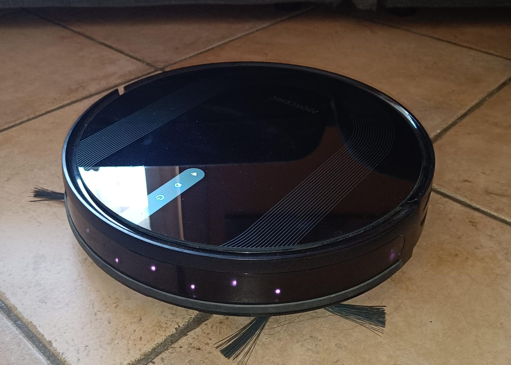
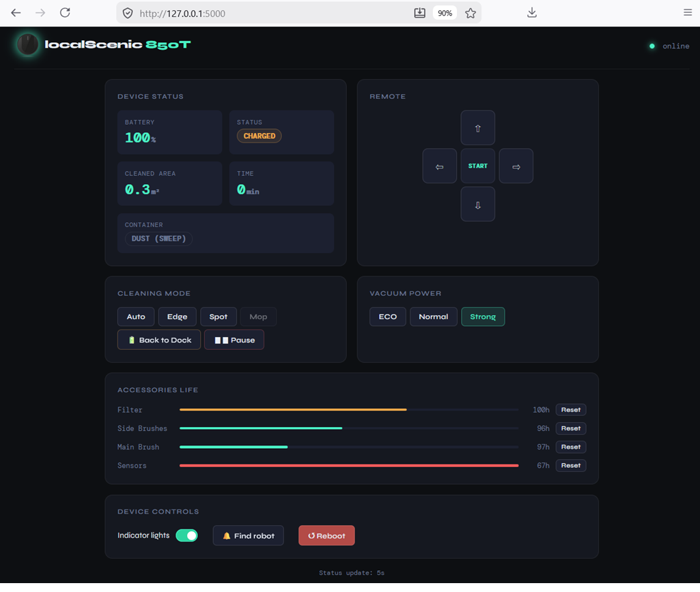

<p align="center">
  
</p>

<p align="center">
  <b>Real-time local control for Proscenic robot vacuums. No cloud. No latency.</b>
</p>

<p align="center">
  Reverse engineered a Proscenic 850T robot vacuum to remove cloud dependency and fix a broken remote.
</p>

<p align="center">
  
  
  
  
  
  
  
  
</p>

---



## 📖 Background

The Proscenic 850T uses **Tuya OEM** as its IoT backend. The official app's virtual remote has a structural flaw: every directional command is processed synchronously, meaning you have to wait for the robot to finish each movement before issuing the next one. Real-time steering is impossible.

This project allows you to control your robot vacuum **entirely over LAN**, bypassing the Proscenic cloud — no account, no internet connection required, no data sent to third-party servers.

The full reverse engineering story — Frida, LDPlayer, localKey extraction, DP mapping — is documented in the companion article on Medium:

📄 **[Read the article →](https://medium.com/@gianluca.palma)**

---

## ✨ Features

- **Real-time directional remote** — keyboard arrows + mouse/touch, `mousedown` sends command, `mouseup` sends stop. Zero latency.
- **Smart START/STOP button** — sends `DP 25 = smart` when idle, `DP 33 = false` when working
- **Cleaning mode selection** — Auto, Edge, Spot, Mop (auto-locked when water tank not detected)
- **Suction power control** — ECO / Normal / Strong with active level highlight
- **Water flow control** — Low / Medium / High (visible only when mop tank is installed)
- **Accessory wear bars** — Filter, Side brush, Main brush, Sensor with one-click reset
- **Fault banner** — animated red banner decoding DP 11 bitmap errors in plain text
- **Device info balloon** — IP, Device ID, Product Key, Serial Number on hover
- **Zero cloud dependency** — communicates directly over LAN, no internet required
- **Auto-polling** — status update every 5 seconds

---

## 📸 Preview



---

## 🔧 Requirements

- Python 3.8+
- pip packages: `flask`, `tinytuya`, `python-dotenv` 
- Your robot on the same LAN as the server
- `devId`, `localKey` and local IP of your device (see [Configuration](#configuration))

```bash
pip install flask tinytuya python-dotenv
```

---

## 🚀 Installation

```bash
# Clone the repo
git clone https://github.com/piuppi/localScenic.git
cd localScenic

# Install dependencies
pip install flask tinytuya python-dotenv

# Edit configuration
nano .env   # set DEVICE_ID, LOCAL_KEY, IP

# Run
python app.py
```

Open your browser at `http://localhost:5000`

To make it accessible from other devices on your LAN, the server already binds to `0.0.0.0:5000`.

---

## ⚙️ Configuration

Create a `.env` file in the project root:

```python
device_id="your_device_id_here"
local_key="your_local_key_here"
device_ip="10.10.x.x"
```

> ⚠️ **Important:** Use a **static IP** for your robot in your router's DHCP settings. The `AUTO` discovery mode is unreliable and may cause connection timeouts.

### How to get devId and localKey

The `devId` and `localKey` are device-specific keys needed to communicate locally with your robot. They are not available through the official Proscenic app or Tuya developer portal (Proscenic uses a separate OEM cloud).

One way to retrieve them is by extracting them from the app at runtime using **Frida** on a rooted Android emulator, unless we disconnect the robot from the Proscenic app and re-pair it via Smart Life (Tuya), which I chose not to do..

📄 The full extraction guide is covered in the [companion Medium article](https://medium.com/@gianluca.palma).

---

## 📡 Data Points (DP) Reference

Complete DP mapping for the Proscenic 850T, obtained by reverse engineering the official app.

### Control DPs

| DP | Name | Values | Access |
|----|------|--------|--------|
| 25 | Cleaning mode | `smart` · `wallfollow` · `sprial` · `mop` · `chargego` | rw |
| 26 | Direction (remote) | `forward` · `backward` · `turnleft` · `turnright` · `stop` | rw |
| 27 | Suction power | `ECO` · `normal` · `strong` | rw |
| 33 | Start / Stop | `true` = working · `false` = stop | rw |
| 50 | Find robot (beep) | `true` | rw |
| 51 | Lights | `true` · `false` | rw |
| 52 | Reboot device | `true` | rw |
| 53 | Fan on/off | `true` · `false` | rw |
| 60 | Water flow | `small` · `medium` · `Big` | rw |

### Status DPs

| DP | Name | Values | Access |
|----|------|--------|--------|
| 11 | Fault bitmap | `0`=ok · `16`=tank missing · `32`=floor sensor · ... | ro |
| 38 | Current state | `0`=standby · `1`=cleaning · `2`=mopping · `3`=edge · `4`=returning · `5`=charging · `6`=spot · `7`=paused · `9`=remote | ro |
| 39 | Battery | 0–100 % | ro |
| 40 | Cleaning record | string (timestamp + area + id) | ro |
| 41 | Cleaned area | value ÷ 10 = m² | ro |
| 42 | Cleaning time | minutes | ro |
| 44 | Sensor life | 0–30 h | ro |
| 45 | Filter life | 0–150 h | ro |
| 47 | Side brush life | 0–200 h | ro |
| 48 | Main brush life | 0–300 h | ro |
| 49 | Tank type | `sweep` = dust tank · `mop` = water tank | ro |
| 58 | Serial number | string | ro |

### Accessory Reset DPs

| DP | Name | Value |
|----|------|-------|
| 54 | Reset sensor | `true` |
| 55 | Reset filter | `true` |
| 56 | Reset side brush | `true` |
| 57 | Reset main brush | `true` |

> **DP 11 bitmap:** value `16` = bit 4 = water tank not installed. Value `32` = bit 5 = floor sensor occluded.

> **Note:** DP 1 (power on/off) and DP 105 (scheduled cleaning) are present in the device model but do not appear to be functional on the 850T hardware.

---

## 📁 Project Structure

```
localScenic/
├── app.py              # Flask backend
├── templates/
│   └── index.html      # Frontend (single file, no JS framework)
└── README.md
```

---

## ⚖️ Legal Disclaimer

This project is an independent, community-driven effort and is **not affiliated with, endorsed by, or connected to Proscenic or Tuya** in any way.

All reverse engineering was performed on hardware owned by the author, on a private local network, for the purpose of interoperability.

No Proscenic or Tuya servers were accessed without authorisation. No credentials belonging to other users were extracted or used.

**Use this software at your own risk.** The author is not responsible for any damage to your device, your network, or any violation of your local laws or terms of service.

---

## 🤝 Contributing

PRs are welcome! In particular:

- Screenshots of the webapp in action
- Testing on other Proscenic models (T10, T20, M8S, etc.)
- DP mapping corrections or additions
- Support for other Tuya-based robot vacuums

Please open an issue first for any significant change.

---

## 📜 License

MIT — do whatever you want, just don't blame me if your robot vacuums the cat.
